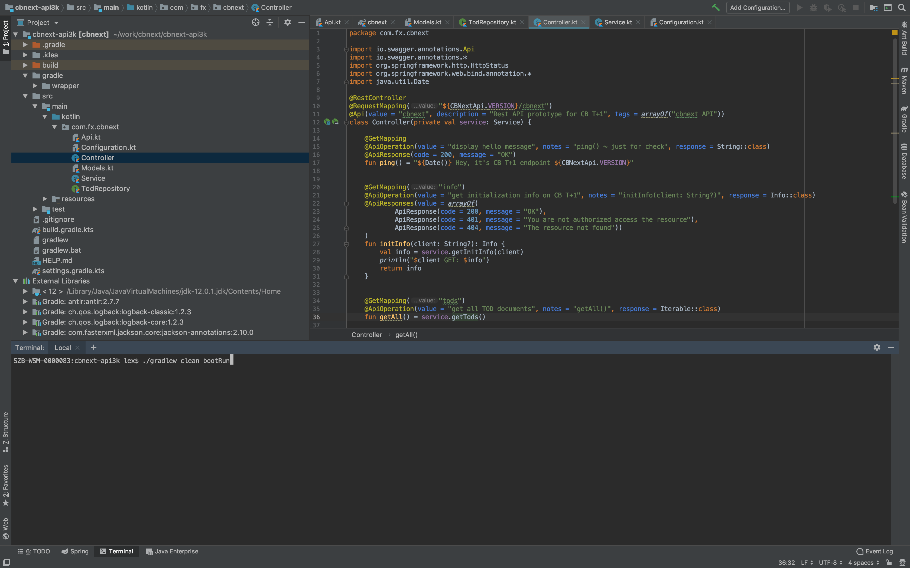
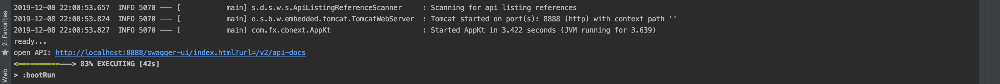
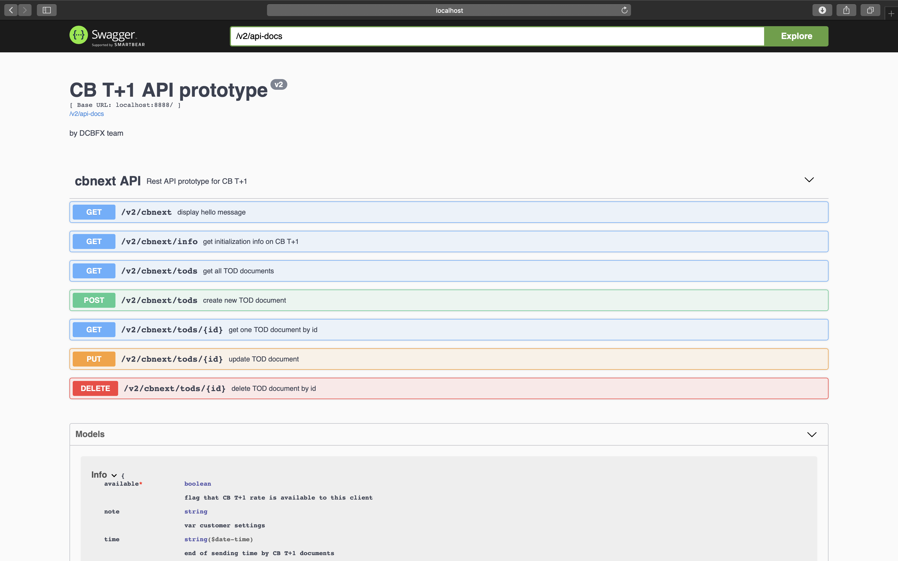
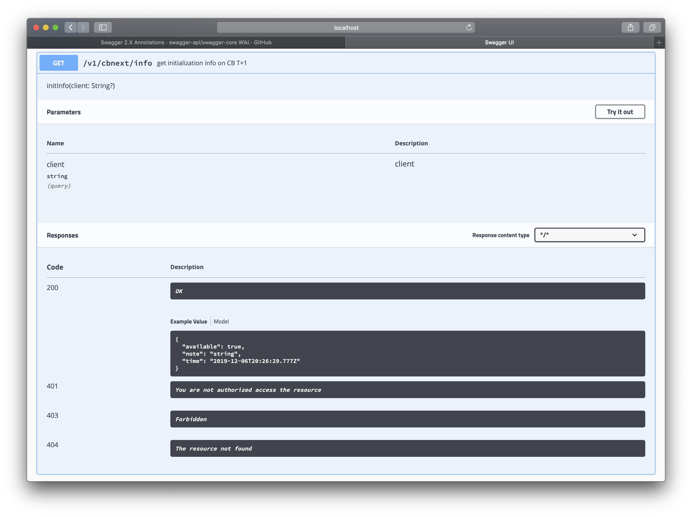
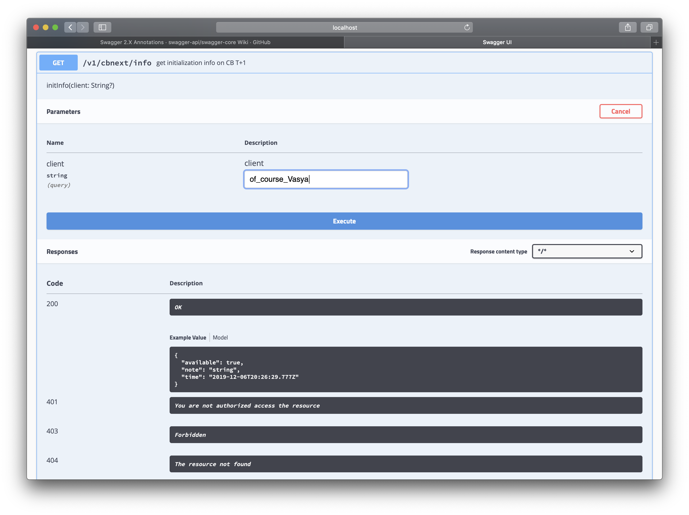
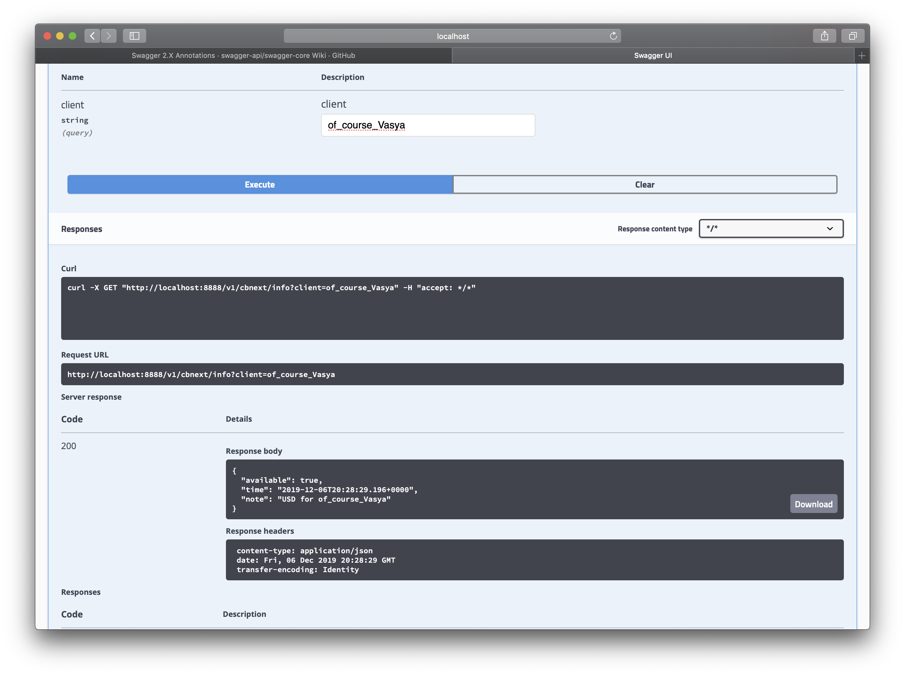
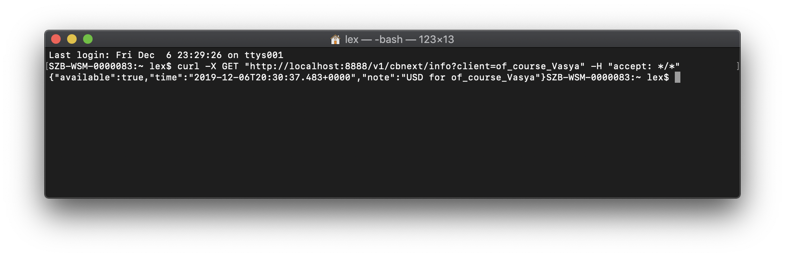
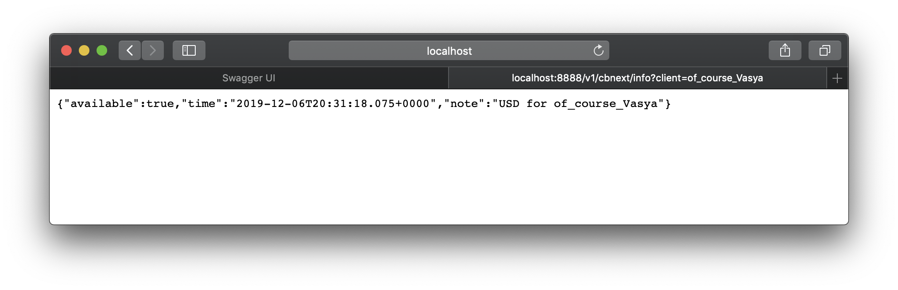

# CB T+1 API prototype v2

### Getting Started

Just run this project by : `./gradlew clean bootRun`

and after "ready..."

go to your favorite browser: http://localhost:8888/swagger-ui/index.html?url=/v2/api-docs

Next, to try any REST:
* choose a method

* click "Try it out" (on the right) and type parameters

* push "Execute"

Also you can check API with terminal

or copy request URL to your browser 

easy!

### Reference documentation
These additional references should also help you:

* [Official Gradle documentation](https://docs.gradle.org)
* [Gradle + Kotlin](https://gradle.org/kotlin/)
* [Spring Boot Gradle Plugin](https://docs.spring.io/spring-boot/docs/2.2.2.RELEASE/gradle-plugin/reference/html/)
* [Official Swagger documentation](https://swagger.io)
* [Swagger annotations](https://github.com/swagger-api/swagger-core/wiki/annotations)
* [Swagger UI documentation](https://swagger.io/tools/swagger-ui/)
* [Swagger real-time support](https://swagger.io/irc/)